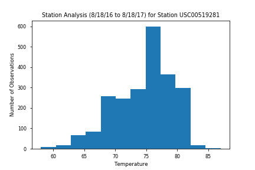
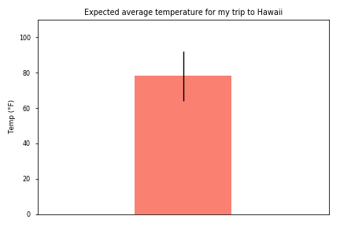

# Surfs Up!

For this analysis I used the [hawaii.sqlite](https://github.com/JoannePeel/The_Surf_is_Up/blob/master/hawaii.sqlite) data base, which contains temperature and precipitation data from 9 different stations on Hawaii.

## Step 1 - Climate Analysis and Exploration

I used Python and SQLAlchemy to do a basic climate analysis and data exploration of the climate database. All of the following analysis were completed using SQLAlchemy ORM queries, Pandas, and Matplotlib.

* To see the complete code, click here: [The_surf_ is_ up!_seaborn.ipynb](https://github.com/JoannePeel/The_Surf_is_Up/blob/master/The_surf_%20is_%20up!_seaborn.ipynb)

### Precipitation Analysis

* A query was designed to retrieve the last 12 months of precipitation data.

* The query results were loaded into a Pandas DataFrame.

* The results were plotted using the DataFrame `plot` method.

  

### Station Analysis

* A query was designed to find the most active stations.
* A second query was designed to retrieve the last 12 months of temperature observation data (tobs).
* The data was filterd by the station, to include only the results for the station with the highest number of observations.

  * The results were plotted using a histogram with `bins=12`.

    
    
### Temperature Analysis 

Using the function called calc_temps which and etering a start date and end date in the format %Y-%m-%d,  minimum, average, and maximum temperatures were calculated for a range of dates.

* The results were plotted as a bar chart, using the average temperature as the bar height and the peak-to-peak (tmax-tmin) value as the y error bar (yerr).    
    
     

- - -

## Step 2 - Climate App

A Flask API  was designed based on the queries above.
* To see the complete code, click here: [climate_app.py](https://github.com/JoannePeel/The_Surf_is_Up/blob/master/climate_app.py)

* I used FLASK to create four routes.

### Routes

* `/`

  * Home page.

  * List of all routes that are available.

* `/api/v1.0/precipitation`

  * The query results were converted to a Dictionary using `date` as the key and `prcp` as the value.

  * Returns the JSON representation of the dictionary.

* `/api/v1.0/stations`

  * Returns a JSON list of all the stations from the dataset.

* `/api/v1.0/tobs`
  * query for the dates and temperature observations from a year from the last data point.
  * Returns a JSON list of Temperature Observations (tobs) for the previous year.

* `/api/v1.0/<start>` and `/api/v1.0/<start>/<end>`

  * Returns a JSON list of the minimum temperature, the average temperature, and the max temperature for a given start or start-end range.

  * When given the start only, calculate `TMIN`, `TAVG`, and `TMAX` for all dates greater than and equal to the start date.

  * When given the start and the end date, calculate the `TMIN`, `TAVG`, and `TMAX` for dates between the start and end date inclusive.

_Data Boot Camp ©2018. All Rights Reserved.
